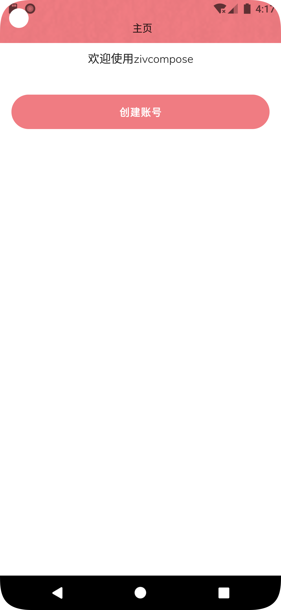
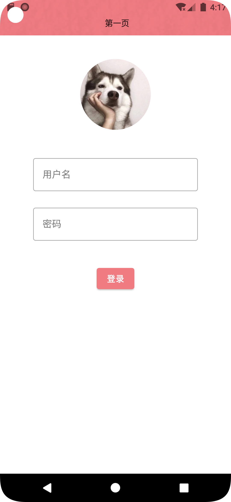
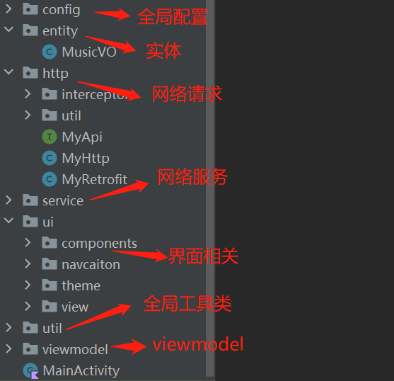
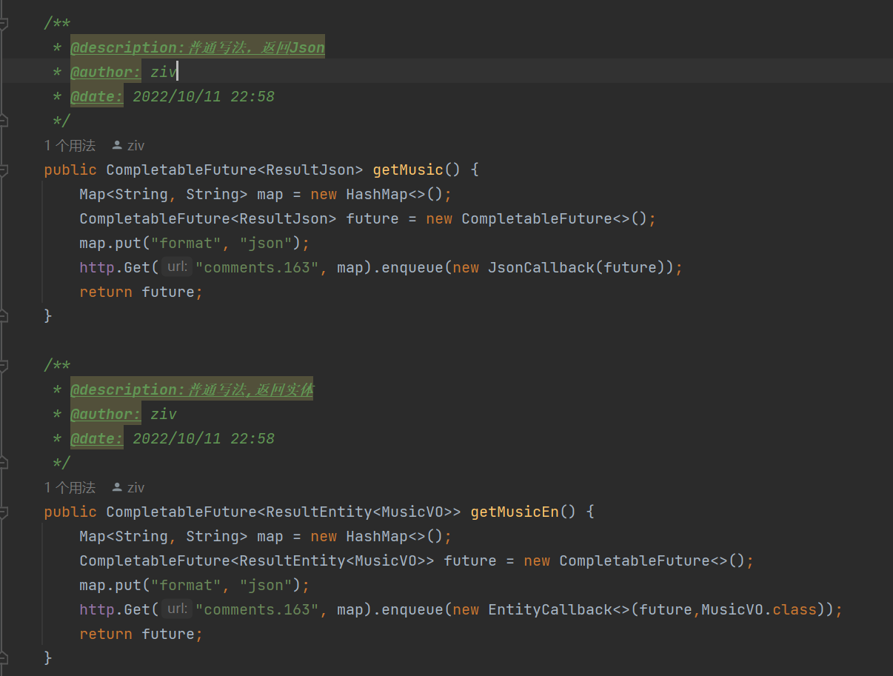
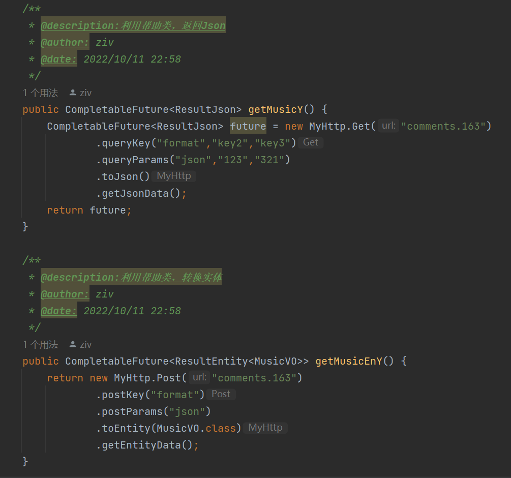
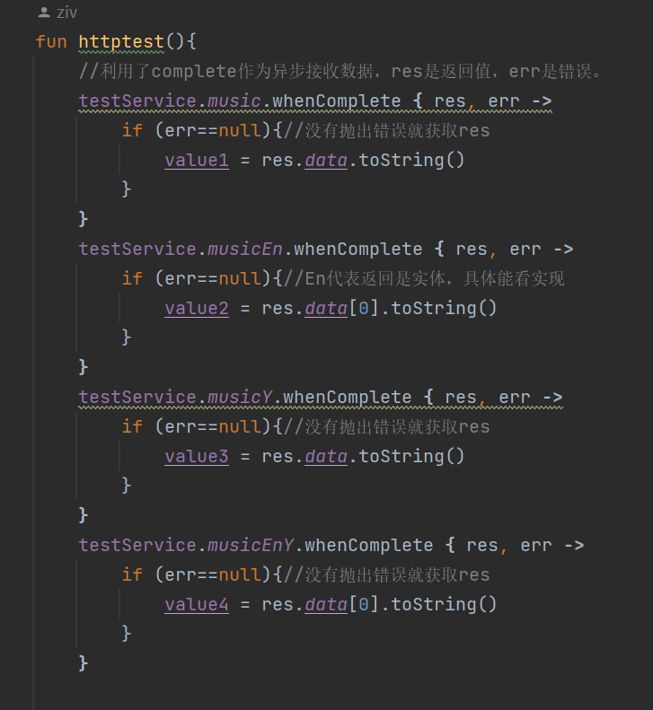

# ZivCompose
composeUi mvvm模板 一切为了优雅写代码。 
##  ##
一点话语：  
1.在大学的时候主要学习java，对于kotlin的语法评价是有好有坏吧，很多东西确实简洁了，但是易读性很差，很多写法像是炫技一样，难以被别人接手维护。  
2.这个模板主要是根据自己的项目的业务演化过来的，目前有点简单，但是面对制造业或者课设的项目应该都能应付。  
**3.主要想法是java作为数据处理的语言，主要用于编写请求服务等；kotlin用于写前端界面，主要用Composeui进行页面编写。这个模式就像vue？ 我觉得vue真的挺好用的。**
4.Compose组件目前唯一的问题是组件比较基础，但是扩展性挺强的，利于进行封装，相信未来很快能出现以compose写的ui组件库。  
5.最后说一下，就是整个项目没什么难的技术点，我技术也不算好，刚毕业没多久，很多技巧都是一个坑一个坑踩过来的，如果觉得有用，也可以自己拉取完善或者提一下意见

##  ##
### 1.封装了网络请求（okhttp3+refroit2） ###
### 2.封装了路由，不用传参就能直接使用 ###
### 3.使用MMKV作为本地存储，封装了工具类，可以存储对象 ###
### 4.添加了广播实例 ###
### 5.添加了viewmodel实例 ###
### 6.实现沉浸式主题 ###

#### 测试页面 ####
#### 目录 ####

#### 导航 ####
    MyNavHost.toPage(RouterConst.firstView)
MyNavHost:导航实例，已经配置好，可以直接调用
RouterConst.firstView：自己配置的目标页面
#### 网络请求 ####

#### 网络取值 ####

